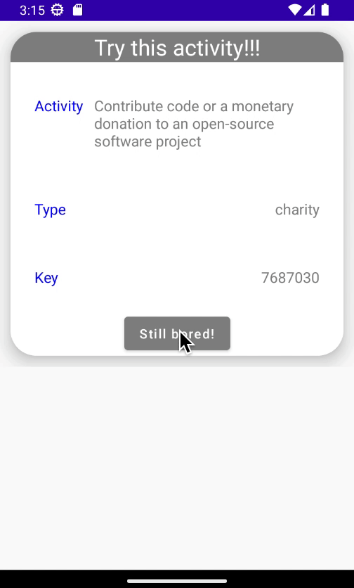

# Bored!
Tried to create a network call using Kotlin and created a minimal UI using JetPack Compose. Didn't follow any particular rules strictly here.

```Used bored API as I was already bored```

## Preview
The UI is minimal, as it was not the focused object.


